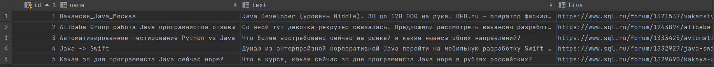

[](https://travis-ci.com/RomanRusanov/parser)
[](https://www.codacy.com/app/RomanRusanov/parser?utm_source=github.com&amp;utm_medium=referral&amp;utm_content=RomanRusanov/parser&amp;utm_campaign=Badge_Grade)
# Парсер вакансий sql.ru

Приложение парсер берет информацию с сайта sql.ru раздел работа и собирает Java вакансии.
Учитывая дубликаты. Вакансии с одинаковым именем считаются дубликатами.
Если это первый запуск, то нужно собрать все объявления с начало года.

### ScreenShot

Собранные данные в таблицу vacany ```db/parser.db```



# Конфигурирование:

```java -jar parser-1.0 app.properties```

Если app.properties не передать будет использована конфигурация по умолчанию
```
src/main/resources/app.properties
```
```
fileDB = parser.db # имя файла для БД
pathToDB = ./db/ # путь где сохранить файл БД
url = jdbc:sqlite: #  БД sqlite
cron.time=0 0 12 * * ? # запускать парсер каждые 12 часов
```

##Контакты:
*   skype: rusanov_roman
*   telegram: @Roman_Rusanov
